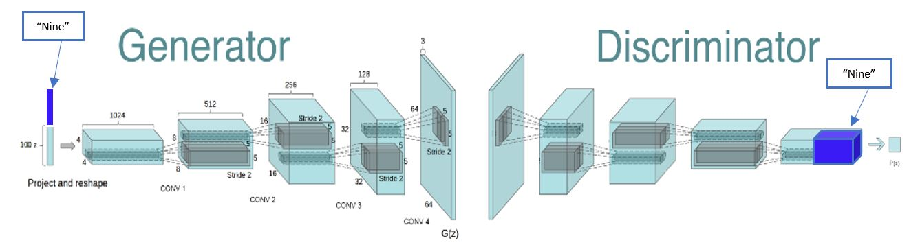
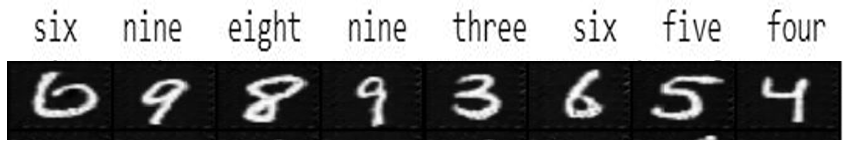

# Text to Image Synthesis – Reverse Optical Character recognition

The motivation behind this project is to understand automatic synthesis of images from a text description. Through this
project, we wanted to explore architectures that could help us achieve our task of generating images. In recent years,
powerful neural network architectures like Generative Adversarial networks (proposed by Ian Goodfellow et al) are
generating highly compelling images. Meanwhile, recurrent neural network architecture has been developed to learn
discriminative text feature representations. In this project, we have developed a similar architecture and GAN
formulation to generate images. We have implemented the paper [Generative Adversarial Text to Image Synthesis](http://proceedings.mlr.press/v48/reed16.pdf) by using a simpler data set (MNIST dataset).

Architecture:

For any input like "six nine eight nine three six five four" the model will generate handwritten images of the corresponding digits. The generated digits are resemble as if they have come from the true distribution.

Example:

For the complete report of the project right from architecture building to model analysis click [here](Text%20to%20Image%20Synthesis%20using%20GAN%20Final%20Report.pdf)

For Image Synthesis, please refer to [this](https://github.com/anant10/GAN-Image2Image) project where Image is generated from random noise. There are two implementations of GAN i.e. Vanilla GAN(Using fully connected neural Network) and DCGAN (using Deep Convolutional Networks).